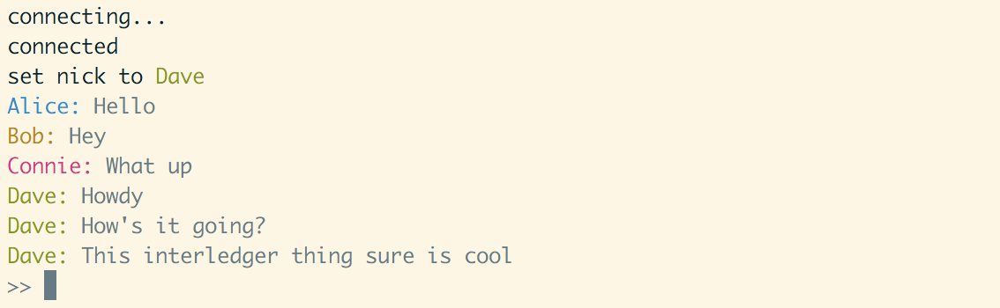

# ILRC
> InterLedger Relay Chat

- [Overview](#overview)
- [Usage](#usage)
  - [Client](#client)
    - [Command Reference](#command-reference)
  - [Server](#server)
    - [Environment Variables](#environment-variables)
- [Protocol Definition](#protocol-definition)
- [TODOs](#todos)



## Overview

ILRC is a chat protocol that rides on top of the Interledger stack instead of
the Internet stack. Using the STREAM protocol to multiplex data and money, ILRC
allows any message to be paid.

ILRC comes with a server and a client implementation.

## Usage

### Client

First, clone the repo and install the dependencies. Then, you can launch the
client in `bin/index.js`.

```sh
git clone git@github.com:sharafian/interledger-relay-chat.git
cd interledger-relay-chat
npm install
node bin/index.js
```

Next, connect to your server. If you don't yet know a server, follow the
[Server](#server) section to set up your own. Once you've connected, set a
nickname with `/nick`. Finally, you can start sending messages to the chat.
In the current version, all messages go to a `#global` channel.

```
/connect http://localhost:6677
/nick Alice
Hello World
```

#### Command-Line Flags

- `--file <ilrcrc file>` - Defaults to `~/.ilrcrc`. If the file exists, then
  the lines are read in and processed line by line. For example, to automatically
  connect to a server and login to your nick, you could have a `~/.ilrcrc` with the
  following contents:

```
/connect http://localhost:6677
/nick alice password
``` 

#### Command Reference

- `/connect <SPSP receiver>` - Connects to a server. This can only be done once.
- `/nick <Name> [Password]` - Set your nickname on the server.
- `/pay <Name> <Amount>` - Send `Amount` units to `Name`.
- `<Text>` - Send a message to the chat. Currently, this goes to `#global`.

### Server

Start by cloning and installing dependencies. Then you can start the server.
It will print the connect command that clients can use to connect to your
server.

```sh
git clone git@github.com:sharafian/interledger-relay-chat.git
cd interledger-relay-chat
npm install
node index.js
```

If you want clients on other machines to connect, use
[Localtunnel](https://localtunnel.me/) to expose port `6677` publicly. Then
point your users to your localtunnel URL.

#### Environment Variables

- `PORT` - The port to run the SPSP receiver on. Default `6677`.

## Protocol Definition

ILRC is based on a JSON protocol, which differentiates it from IRC (based in plaintext).

#### Nick

Set nickname. Equivalent to IRC's `NICK`.

```json
{
  "type": "nick",
  "nick": "Alice"
}
```

#### Privmsg

Send message to channel or user. Equivalent to IRC's `PRIVMSG`.

```json
{
  "type": "privmsg",
  "channel": "#global",
  "message": "Hello World!"
}
```

#### Pay

Send money to a user. A `channel` parameter specifies which channel
to inform about this. This message must be sent along with money.

```json
{
  "type": "pay",
  "payee": "Alice",
  "channel": "#global"
}
```

## TODOs

- [X] Join and register nickname
- [X] Send message
- [X] Send message with money
- [ ] Join channels
- [X] Fix up UI
- [X] Neaten up code
- [X] Connect by Payment Pointer
- [ ] Password persistence
- [ ] Fix the readline interrupt when notifications come in
- [ ] Convert server units to local units for display
